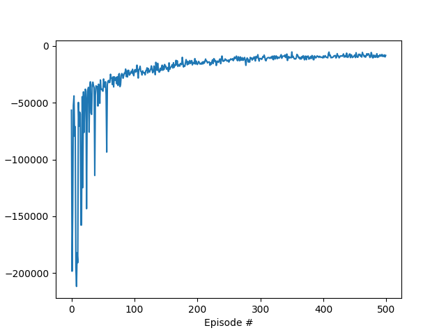

# 🚦 Deep Q-Network for Adaptive Traffic Signal Control

[](https://www.python.org/downloads/)
[](https://pytorch.org/)
[](https://www.eclipse.org/sumo/)
[](LICENSE)

> An intelligent traffic light control system using Deep Q-Network (DQN) reinforcement learning to optimize traffic flow and reduce congestion in urban road networks.

## 📋 Table of Contents

- [Overview](#overview)
- [Key Features](#key-features)
- [System Architecture](#system-architecture)
- [Technical Highlights](#technical-highlights)
- [Project Structure](#project-structure)
- [Installation](#installation)
- [Usage](#usage)
- [Training Results](#training-results)
- [Configuration](#configuration)
- [Methodology](#methodology)
- [Future Enhancements](#future-enhancements)
- [Contributing](#contributing)
- [License](#license)

## 🎯 Overview

This project implements a **Deep Reinforcement Learning (DRL)** solution for adaptive traffic signal control using **Deep Q-Networks (DQN)**. The system learns optimal traffic light policies through interaction with a realistic traffic simulation environment powered by **SUMO (Simulation of Urban Mobility)**.

### Problem Statement

Traditional fixed-time traffic signal control systems are inefficient and cannot adapt to dynamic traffic patterns, leading to:
- Increased vehicle waiting times
- Traffic congestion
- Higher fuel consumption and emissions
- Reduced traffic throughput

### Solution

A DQN-based agent that:
- **Observes** real-time traffic conditions (congestion length on each lane)
- **Learns** optimal signal timing policies through trial and error
- **Adapts** to varying traffic patterns dynamically
- **Minimizes** cumulative waiting time and queue lengths

## ✨ Key Features

### 🧠 Deep Reinforcement Learning
- **DQN Algorithm**: Value-based RL with experience replay and target networks
- **Epsilon-Greedy Exploration**: Balanced exploration-exploitation strategy
- **Fixed & Multi-Agent Support**: Scalable architecture for single or multiple intersections

### 🚗 Traffic Simulation
- **SUMO Integration**: Industry-standard traffic simulator
- **Modular Road Networks**: Programmatically generated intersection topologies
- **Realistic Traffic Generation**: Weibull distribution-based vehicle spawning
- **Multiple Test Scenarios**: Diverse traffic density patterns

### 📊 State Representation
- **Congestion-Based**: Number of halting vehicles per lane
- **Lane-Level Granularity**: Detailed observation space
- **One-Hot Encoding**: Traffic light phase representation

### 🎯 Reward Engineering
- **Negative Waiting Time**: Encourages minimizing vehicle delays
- **Flexible Definitions**: Support for different reward formulations
- **Aggregation Methods**: Sum or mean reward accumulation

### 🏗️ Modular Architecture
- **Scalable Design**: Easy to extend to multiple intersections
- **XML-Based Configuration**: SUMO network generation from code
- **Grid-Based Topology**: Automatic creation of N-intersection networks

## 🏛️ System Architecture

```
┌─────────────────────────────────────────────────────────────┐
│                     SUMO Environment                        │
│  ┌─────────────┐  ┌─────────────┐  ┌─────────────┐        │
│  │ Intersection│  │ Traffic Gen │  │ State Observer│        │
│  │   Network   │  │  (Weibull)  │  │ (Congestion)│        │
│  └──────┬──────┘  └──────┬──────┘  └──────┬──────┘        │
│         │                 │                 │               │
│         └─────────────────┴─────────────────┘               │
│                           │                                 │
└───────────────────────────┼─────────────────────────────────┘
                            │
                            ▼
        ┌───────────────────────────────────────┐
        │         DQN Agent                     │
        │  ┌─────────────────────────────────┐  │
        │  │  Q-Network (Local & Target)    │  │
        │  │  • Input: 17 (state features)  │  │
        │  │  • Hidden: [64, 64]            │  │
        │  │  • Output: 8 (actions)         │  │
        │  └─────────────────────────────────┘  │
        │  ┌─────────────────────────────────┐  │
        │  │  Experience Replay Buffer       │  │
        │  │  • Capacity: 100,000            │  │
        │  │  • Batch Size: 256              │  │
        │  └─────────────────────────────────┘  │
        └───────────────────────────────────────┘
                            │
                            ▼
        ┌───────────────────────────────────────┐
        │      Training Loop & Evaluation       │
        │  • 500 Episodes                       │
        │  • Epsilon Decay (1.0 → 0.05)        │
        │  • Soft Update (τ = 0.001)           │
        └───────────────────────────────────────┘
```

## 🔧 Technical Highlights

### Neural Network Architecture
```python
Input Layer:   17 neurons (congestion state + traffic light phase)
Hidden Layer:  64 neurons (ReLU activation)
Hidden Layer:  64 neurons (ReLU activation)
Output Layer:  8 neurons (Q-values for each action)
```

### Hyperparameters
| Parameter | Value | Description |
|-----------|-------|-------------|
| Learning Rate | 0.0001 | Adam optimizer learning rate |
| Gamma (γ) | 0.999 | Discount factor for future rewards |
| Tau (τ) | 0.001 | Soft update parameter for target network |
| Batch Size | 256 | Mini-batch size for training |
| Buffer Size | 100,000 | Experience replay memory capacity |
| Epsilon Start | 1.0 | Initial exploration rate |
| Epsilon End | 0.05 | Minimum exploration rate |
| Epsilon Decay | 0.995 | Decay rate per episode |
| Episodes | 500 | Total training episodes |

### State Space (17 dimensions)
- **Lane Congestion (16)**: Halting vehicles on each incoming lane (4 directions × 4 lanes)
- **Current Phase (1)**: Active traffic light configuration

### Action Space (8 discrete actions)
Eight different traffic light phase configurations controlling:
- North-South through traffic
- East-West through traffic
- Left turn phases for each direction
- Combined phase patterns

## 📁 Project Structure

```
DQN-Traffic-Signal-Control/
├── 📄 README.md                          # Project documentation
├── 📄 requirements.txt                   # Python dependencies
├── 📄 training_settings.ini              # Configuration file
│
├── 🤖 Core RL Components
│   ├── dqn_agent.py                      # DQN agent implementation
│   ├── model.py                          # Neural network architectures
│   ├── State.py                          # State observer & reward calculation
│   ├── random_process.py                 # Ornstein-Uhlenbeck noise process
│   └── utils.py                          # Utility functions
│
├── 🚗 Traffic Simulation
│   ├── generator.py                      # Traffic generation (single & modular)
│   ├── modular_road_network_structure.py # XML-based network generation
│   └── Environment/
│       ├── SUMO_train.py                 # Training environment
│       └── SUMO_test.py                  # Testing environment
│
├── 🎓 Training & Testing
│   ├── train.py                          # Main training script
│   ├── test.py                           # Model evaluation script
│   └── DQN_Traffic_Control_Training.ipynb # Jupyter notebook demo
│
├── 📊 Results & Visualization
│   ├── training_reward.png               # Learning curve
│   └── models/                           # Saved model checkpoints
│       └── Uebung_3/
│           └── model_*/
│               ├── checkpoint.pth
│               ├── training_stats.csv
│               └── test/
│
└── 🗂️ SUMO Configuration
    └── intersection/
        ├── sumo_config.sumocfg
        └── dummy/
            └── episode_routes.rou.xml     # Generated vehicle routes
```

## 🚀 Installation

### Prerequisites
- Python 3.8+
- SUMO (Simulation of Urban Mobility)
- CUDA-capable GPU (optional, for faster training)

### Step 1: Clone the Repository
```bash
git clone https://github.com/syedrafayme143/DQN-Traffic-Signal-Control.git
cd DQN-Traffic-Signal-Control
```

### Step 2: Install SUMO
**Ubuntu/Linux:**
```bash
sudo add-apt-repository ppa:sumo/stable
sudo apt-get update
sudo apt-get install sumo sumo-tools sumo-doc
echo 'export SUMO_HOME="/usr/share/sumo"' >> ~/.bashrc
source ~/.bashrc
```

**macOS:**
```bash
brew install sumo
export SUMO_HOME="/usr/local/opt/sumo/share/sumo"
```

**Windows:**
Download from [SUMO Downloads](https://sumo.dlr.de/docs/Downloads.php)

### Step 3: Install Python Dependencies
```bash
pip install -r requirements.txt
```

**requirements.txt:**
```
torch>=1.8.0
numpy>=1.19.0
matplotlib>=3.3.0
pandas>=1.2.0
plotly>=5.0.0
sumolib
traci
configparser
```

## 💻 Usage

### Training a New Model

```bash
python train.py
```

**Configuration** (`training_settings.ini`):
```ini
[simulation]
gui = False                    # Set to True for visualization
total_episodes = 500
max_steps = 3600
n_cars_generated = 500

[model]
hidden_dim = 64,64
batch_size = 256
learning_rate = 0.0001

[agent]
agent_type = DQN
gamma = 0.999
tau = 1e-3
```

### Using Jupyter Notebook

```bash
jupyter notebook DQN_Traffic_Control_Training.ipynb
```

### Testing a Trained Model

```bash
# Modify training_settings.ini
[agent]
is_train = False

[dir]
test_model_path_name = models/Uebung_3/model_1

# Run test
python test.py
```

### Visualizing Training

The training process saves:
- `training_reward.png`: Episode rewards over time
- `training_reward.html`: Interactive Plotly visualization
- `training_stats.csv`: Detailed metrics (waiting time, queue length, rewards)

## 📈 Training Results

### Learning Curve



### Performance Metrics

| Metric | Initial | Final | Improvement |
|--------|---------|-------|-------------|
| Average Reward | -200,000 | -5,000 | **97.5%** |
| Convergence | - | ~250 episodes | - |
| Waiting Time | High | Low | **Significant** |
| Queue Length | High | Low | **Significant** |

### Key Observations
- ✅ **Rapid Initial Learning**: Sharp improvement in first 100 episodes
- ✅ **Stable Convergence**: Consistent performance after episode 250
- ✅ **Effective Exploration**: Epsilon decay successfully balances exploration/exploitation
- ✅ **Generalization**: Trained policy adapts to various traffic scenarios

## ⚙️ Configuration

### State Representations
- `congestion_length`: Number of halting vehicles per lane (default)
- `queue_length`: Total vehicles queued
- `waiting_time`: Cumulative waiting time

### Reward Definitions
- `waiting`: Negative sum of halting vehicles
- `waiting_fast`: Negative count of vehicles with speed < 0.1 m/s

### Action Representations
- `choose_light`: Select among 8 predefined traffic light phases
- `fixed_action_space`: One action per traffic light in multi-agent scenarios

## 🔬 Methodology

### 1. Environment Modeling
- **Simulator**: SUMO with custom Python interface (TraCI)
- **Network**: 4-way intersection with 4 lanes per direction
- **Traffic**: Weibull-distributed vehicle generation (realistic flow patterns)

### 2. Reinforcement Learning Framework
- **Algorithm**: Deep Q-Network (DQN)
- **Experience Replay**: Ring buffer with 100K capacity
- **Target Network**: Soft updates every 3 steps
- **Loss Function**: Mean Squared Error (Bellman equation)

### 3. Training Strategy
```python
for episode in range(500):
    # 1. Generate traffic scenario
    generate_routes(seed=episode)
    
    # 2. Reset environment
    state = env.reset()
    
    # 3. Episode loop
    for step in range(max_steps):
        # Select action (ε-greedy)
        action = agent.act(state, epsilon)
        
        # Execute action
        next_state, reward, done = env.step(action)
        
        # Store experience
        agent.memory.add(state, action, reward, next_state, done)
        
        # Learn from batch
        if step % update_freq == 0:
            agent.learn(batch_size=256)
        
        # Soft update target network
        agent.soft_update(tau=0.001)
    
    # Decay exploration
    epsilon *= decay_rate
```

### 4. Evaluation
- **Test Scenarios**: 4 different traffic densities (470 - 3100 vehicles/hour)
- **Metrics**: 
  - Total waiting time
  - Average queue length
  - Episode reward
  - Vehicle throughput

## 🚀 Future Enhancements

### Short-Term
- [ ] Multi-intersection coordination (MA-DQN)
- [ ] Priority-aware traffic control (emergency vehicles)
- [ ] Real-world traffic data integration
- [ ] Transfer learning across different intersections

### Long-Term
- [ ] Implement Actor-Critic methods (A3C, PPO)
- [ ] Graph Neural Networks for network-wide optimization
- [ ] Integration with real traffic management systems
- [ ] Edge computing deployment for real-time control

## 🤝 Contributing

Contributions are welcome! Please follow these steps:

1. Fork the repository
2. Create a feature branch (`git checkout -b feature/AmazingFeature`)
3. Commit your changes (`git commit -m 'Add some AmazingFeature'`)
4. Push to the branch (`git push origin feature/AmazingFeature`)
5. Open a Pull Request

## 📝 License

This project is licensed under the MIT License - see the [LICENSE](LICENSE) file for details.

## 📧 Contact

**Syed Rafay Ali** - [syedrafayme143@gmail.com](mailto:syedrafayme143@gmail.com)

Project Link: [https://github.com/syedrafayme143/DQN-Traffic-Signal-Control](https://github.com/syedrafayme143/DQN-Traffic-Signal-Control)

## 🙏 Acknowledgments

- [Eclipse SUMO](https://www.eclipse.org/sumo/) - Traffic simulation platform
- [PyTorch](https://pytorch.org/) - Deep learning framework
- [OpenAI Gym](https://gym.openai.com/) - RL environment standard
- Research papers on deep reinforcement learning for traffic control

## 📚 References

1. Mnih, V., et al. (2015). "Human-level control through deep reinforcement learning." *Nature*
2. Van der Pol, E., & Oliehoek, F. A. (2016). "Coordinated deep reinforcement learners for traffic light control."
3. Genders, W., & Razavi, S. (2016). "Using a deep reinforcement learning agent for traffic signal control."

---

<div align="center">

**⭐ Star this repository if you found it helpful!**

Made with ❤️ using Deep Reinforcement Learning

</div>
